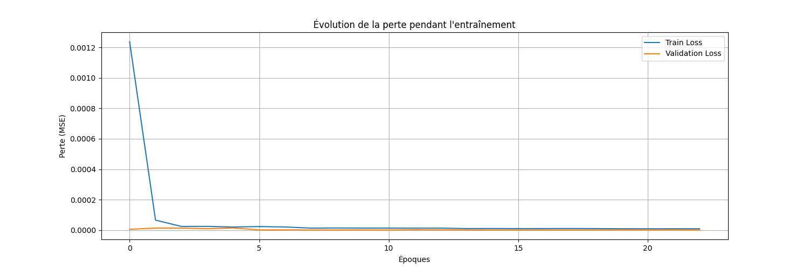
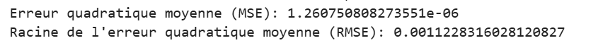
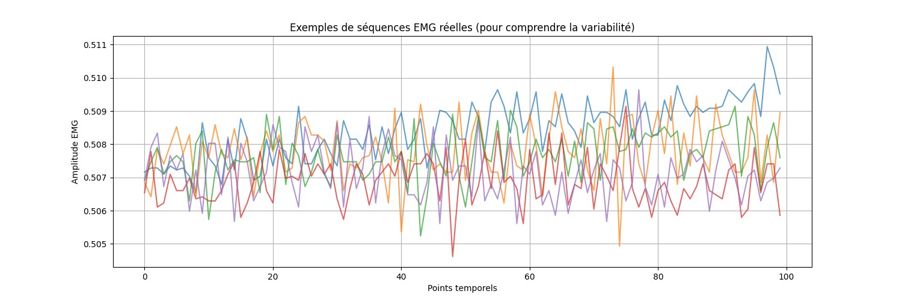
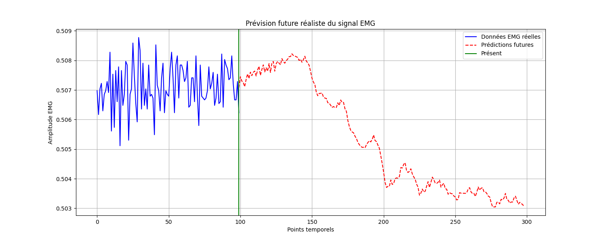
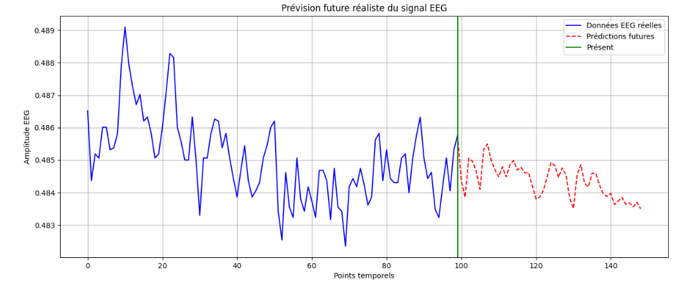

==========================================
Guide d'utilisation - SleepDisorderDetect
==========================================

:Auteur: AMRI Maryam Et BOUGHNAM Houda
:Date: 21/05/2025
:Version: 1.0.0
:Contact: amrimaryam780@gmail.com

.. contents:: Table des matières
   :depth: 2
   :backlinks: none

Projet de détection des troubles du sommeil basé sur l'analyse de PSG
====================================================================

Ce guide détaillé explique comment utiliser le projet de détection des troubles 
du sommeil à partir de données polysomnographiques (PSG) au format `.edf`. 
Le système analyse les signaux physiologiques pour identifier trois troubles 
principaux : l'insomnie, l'apnée du sommeil et la narcolepsie.

Prérequis
=========

Avant de commencer, assurez-vous d'avoir :

* Un compte Kaggle avec accès aux notebooks
* Connaissance de base de Python et des notebooks Jupyter
* Un fichier PSG au format `.edf` (par exemple de la base de données Sleep-EDF)
* Accès à internet pour le chargement des bibliothèques nécessaires

Utilisation du notebook Kaggle
=============================

Le projet est entièrement implémenté dans un notebook Kaggle. Pour l'utiliser :

1. Accédez au notebook via le lien fourni ou copiez-le dans votre espace Kaggle
2. Téléchargez votre fichier `.edf` dans l'espace de données Kaggle
3. Exécutez les cellules du notebook dans l'ordre

Structure du notebook
===================

Le notebook est organisé en sections correspondant aux différentes étapes du pipeline de traitement :

::

    1. Configuration et importation des bibliothèques
    2. Chargement des fichiers .edf
    3. Transformation des signaux en CSV
    4. Prétraitement des données
    5. Prédiction des signaux (EEG et EMG)
    6. Détection des troubles du sommeil
    7. Visualisation des résultats

Étapes détaillées du pipeline
============================

1. Importation du fichier `.edf`
----------------------------------

Dans cette section du notebook, vous importez votre fichier PSG au format `.edf`.

*Code à exécuter dans le notebook* :

.. code-block:: python

    import mne
    import os
    
    # Spécifiez le chemin vers votre fichier .edf
    edf_file = '../input/sleep-edf-database-expanded/SC4001E0-PSG.edf'
    
    # Chargement du fichier EDF
    raw = mne.io.read_raw_edf(edf_file, preload=True)
    
    # Affichage des informations sur les canaux disponibles
    print(raw.info)
    
    # Liste des canaux disponibles
    print("Canaux disponibles:", raw.ch_names)

**Résultat attendu** :
- Affichage des canaux disponibles dans le fichier EDF
- Confirmation que les signaux EEG (Fpz-Cz), EMG et EOG sont présents
- Affichage des caractéristiques des signaux (fréquence d'échantillonnage, etc.)

**Conseils** :
- Vérifiez que les canaux EEG, EMG et EOG sont correctement identifiés
- Assurez-vous que la fréquence d'échantillonnage est suffisante (généralement 100 Hz)

2. Transformation en CSV
-----------------------

Cette section du notebook convertit les signaux bruts du fichier ``.edf`` en DataFrames pandas pour faciliter l'analyse.

*Code à exécuter dans le notebook* :

.. code-block:: python

    import pandas as pd
    import numpy as np

    # Extraire les signaux en DataFrames
    eeg_data = raw.get_data(picks=['EEG Fpz-Cz'])
    emg_data = raw.get_data(picks=['EMG submental'])
    eog_data = raw.get_data(picks=['EOG horizontal'])

    # Créer des DataFrames pandas
    sampling_freq = raw.info['sfreq']
    times = np.arange(0, len(eeg_data[0])) / sampling_freq

    eeg_df = pd.DataFrame({
    'timestamp': times,
    'value': eeg_data[0],
    'channel': 'EEG Fpz-Cz'
    })

    emg_df = pd.DataFrame({
    'timestamp': times,
    'value': emg_data[0],
    'channel': 'EMG submental'
    })

    eog_df = pd.DataFrame({
    'timestamp': times,
    'value': eog_data[0],
    'channel': 'EOG horizontal'
    })

   # Sauvegarder en CSV si nécessaire (optionnel dans Kaggle)
   eeg_df.to_csv('eeg.csv', index=False)
   emg_df.to_csv('emg.csv', index=False)
   eog_df.to_csv('eog.csv', index=False)

   # Afficher les premières lignes pour vérification
   print("Données EEG:")
   print(eeg_df.head())

   # Fusionner tous les signaux dans une seule DataFrame
  dftotal = pd.concat([eeg_df, emg_df, eog_df], ignore_index=True)

  # Afficher les premières lignes de la DataFrame fusionnée
  print("\nDonnées fusionnées (dftotal):")
  print(dftotal.head())

  # Sauvegarder la DataFrame fusionnée en CSV si nécessaire
  dftotal.to_csv('all_signals.csv', index=False)

*Résultat attendu* :
- Création de trois DataFrames contenant les signaux EEG, EMG et EOG
- Structure des DataFrames avec colonnes : timestamp, value, channel
- Affichage des premières lignes de données pour vérification
- Creation d'une dataframe dftotal qui contient tous les signaux
3. Prétraitement des données
---------------------------

Cette section du notebook nettoie et prépare les données pour l'analyse.

*Code à exécuter* :

.. code-block:: python

    import statsmodels.api as sm
    import pandas as pd
    from sklearn.preprocessing import MinMaxScaler
    import matplotlib.pyplot as plt
    dftotal.isna().sum()
    dftotal.dropna(inplace=True)
    
    sm.qqplot(dftotal.Label, line='s')
    sm.qqplot(dftotal["EEG Fpz-Cz"], line='s')

    # Supposons que votre DataFrame est dftotal
    colonnes_signaux = ['EEG Fpz-Cz', 'EEG Pz-Oz', 'EOG horizontal', 'EMG submental']

    # Initialiser le MinMaxScaler (par défaut, mise à l'échelle entre 0 et 1)
    scaler = MinMaxScaler()

    # Appliquer la normalisation aux colonnes sélectionnées
    dftotal[colonnes_signaux] = scaler.fit_transform(dftotal[colonnes_signaux])
    
    dftotal['EEG Fpz-Cz'].plot(title="EEG Fpz-Cz	",figsize=(20,5))
    plt.show()
    
    dftotal['EEG Pz-Oz'].plot(title="EEG Pz-Oz",figsize=(20,5))
    plt.show()
  
    dftotal['EOG horizontal'].plot(title="EOG horizontal",figsize=(20,5))
    plt.show() 

*Résultat attendu* :
- DataFrames prétraités avec :
  - Pas de valeurs manquantes
  - Signal normalisé 
  - Graphiques montrant les signaux  après prétraitement

  .. image:: _static/images/avant.png
    :alt: Avant le pretraitement 
    :width: 500px

  .. image:: _static/images/apres.png
    :alt: Apres le pretraitement 
    :width: 500px

4. Prédiction du signal EMG
--------------------------

Cette section présente une approche avancée pour analyser le signal EMG afin de détecter des mouvements anormaux. Le système utilise des techniques d'apprentissage profond pour modéliser les patterns complexes présents dans les signaux cérébraux.

### Composantes principales

1. *Prétraitement des données*: Normalisation des signaux EEG bruts
2. *Extraction de caractéristiques*: Calcul de métriques statistiques, fréquentielles et de complexité
3. *Modélisation hybride*: Combinaison de couches convolutives et LSTM bidirectionnelles
4. *Prédiction adaptative*: Génération de signaux EEG futurs avec maintien des propriétés statistiques

Section 1: Configuration et importation des bibliothèques
--------------------------------------------------------

.. code-block:: python

    import numpy as np
    import pandas as pd
    import matplotlib.pyplot as plt
    from sklearn.preprocessing import MinMaxScaler
    from sklearn.metrics import mean_squared_error
    import tensorflow as tf
    from tensorflow.keras.models import Sequential, Model
    from tensorflow.keras.layers import LSTM, Dense, Dropout, Bidirectional, Conv1D, MaxPooling1D, Input
    from tensorflow.keras.layers import LayerNormalization, GaussianNoise, Concatenate, Add, GlobalAveragePooling1D
    from tensorflow.keras.callbacks import EarlyStopping, ModelCheckpoint, ReduceLROnPlateau
    from tensorflow.keras.optimizers import Adam
    import seaborn as sns

    # Configuration pour améliorer les performances
    physical_devices = tf.config.list_physical_devices('GPU')
    if physical_devices:
        tf.config.experimental.set_memory_growth(physical_devices[0], True)

    # Définir les paramètres de graines aléatoires pour la reproductibilité
    np.random.seed(42)
    tf.random.set_seed(42)

Cette section importe toutes les bibliothèques nécessaires pour le traitement des données, la création de modèles deep learning et la visualisation. Elle configure également le GPU pour une utilisation optimale de la mémoire et définit des graines aléatoires pour assurer la reproductibilité des résultats.

Section 2: Préparation des données
----------------------------------

.. code-block:: python

    # Vérifier si dftotal existe, sinon créer des données synthétiques pour test
    try:
        eeg_data = dftotal['EMG submental'].values  # Utilisation de vos données
    except NameError:
        print("Variable 'dftotal' not found. Creating synthetic data for testing...")
        # Générer des données EMG synthétiques pour test
        n_samples = 3000
        t = np.linspace(0, 30, n_samples)
        eeg_data = np.sin(0.5*t) + 0.2*np.sin(2.5*t) + 0.1*np.sin(7.5*t) + 0.05*np.random.randn(n_samples)

    # Paramètres du modèle - optimisés pour préserver les fluctuations
    sequence_length = 30  # Raccourci pour capturer les oscillations à plus haute fréquence
    pred_length = 1  # Prédire un point à la fois
    stride = 1  # Augmenter le nombre d'exemples d'entraînement
    batch_size = 32  # Petit batch pour meilleur ajustement
    epochs = 50  # Plus d'epochs pour un apprentissage plus fin

    # Normalisation des données - StandardScaler peut être préférable pour préserver les variations
    scaler = MinMaxScaler(feature_range=(0, 1))
    eeg_data_scaled = scaler.fit_transform(eeg_data.reshape(-1, 1)).flatten()

    # Échantillonnage des données
    sample_size = min(150000, len(eeg_data_scaled))  # S'assurer que sample_size n'est pas supérieur à la taille des données
    eeg_sample = eeg_data_scaled[:sample_size]

Ce code prépare les données EMG pour l'analyse. Il tente d'abord d'utiliser les données réelles (depuis `dftotal`), mais génère des données synthétiques si nécessaire. Les données sont ensuite normalisées avec MinMaxScaler pour ramener toutes les valeurs entre 0 et 1, ce qui facilite l'apprentissage du modèle.

Section 3: Fonction d'extraction de caractéristiques
---------------------------------------------------

.. code-block:: python

    def extract_features(data, seq_length):
        """Extraire des caractéristiques avancées du signal EMG"""
        features = []
        
        # Vérifier que les données ont une forme correcte
        if len(data.shape) > 1 and data.shape[0] == 1:
            data = data.flatten()
        
        # Vérifier que la séquence est assez longue
        if len(data) < seq_length:
            print(f"Warning: Data length {len(data)} is less than sequence length {seq_length}")
            # Padding si nécessaire
            if len(data) > 0:
                padding = np.zeros(seq_length - len(data))
                data = np.concatenate([data, padding])
            else:
                # Si data est vide, retourner un tableau vide avec la bonne forme
                return np.zeros((0, 11))
        
        for i in range(len(data) - seq_length + 1):
            segment = data[i:i+seq_length]
            
            # Caractéristiques statistiques
            mean = np.mean(segment)
            std = np.std(segment)
            min_val = np.min(segment)
            max_val = np.max(segment)
            range_val = max_val - min_val
            
            # Tendance et variation
            gradient = np.gradient(segment).mean()
            abs_gradient = np.abs(np.gradient(segment)).mean()  # Mesure de la variabilité globale
            
            # Analyse fréquentielle
            fft_vals = np.abs(np.fft.rfft(segment))
            # S'assurer que fft_vals a au moins un élément avant d'accéder à l'index 1
            if len(fft_vals) > 1:
                dominant_freq_idx = np.argmax(fft_vals[1:]) + 1  # Ignorer DC (indice 0)
                dominant_freq_val = fft_vals[dominant_freq_idx] / len(segment)
            else:
                dominant_freq_val = 0
            
            # Entropie approximative (mesure de la complexité/régularité)
            # Version simplifiée, considérez une implémentation plus complète au besoin
            diffs = np.diff(segment)
            direction_changes = np.sum(np.diff(np.signbit(diffs)) != 0)
            complexity = direction_changes / max(1, (seq_length - 2))  # Éviter division par zéro
            
            # Caractéristiques de forme d'onde
            peak_count = len(np.where(np.diff(np.signbit(np.diff(segment))) < 0)[0])  # Nombre de pics
            zero_crossings = len(np.where(np.diff(np.signbit(segment)))[0])  # Nombre de passages à zéro
            
            # Regrouper toutes les caractéristiques
            feature_vec = np.array([
                mean, std, min_val, max_val, range_val, 
                gradient, abs_gradient, 
                dominant_freq_val, complexity,
                peak_count / max(1, seq_length), zero_crossings / max(1, seq_length)  # Éviter division par zéro
            ])
            
            features.append(feature_vec)
        
        return np.array(features)

Cette fonction extrait des caractéristiques avancées du signal EMG qui aideront le modèle à mieux capturer la complexité des données. Les caractéristiques incluent:
- Statistiques de base (moyenne, écart-type, min, max, range)
- Mesures de tendance et variation (gradient moyen, gradient absolu moyen)
- Analyse fréquentielle (fréquence dominante)
- Mesures de complexité (entropie approximative)
- Caractéristiques de forme d'onde (nombre de pics, passages à zéro)

Section 4: Création de séquences enrichies
------------------------------------------

.. code-block:: python

    def create_enriched_sequences(data, seq_length, pred_length=1, stride=1):
        """Crée des séquences d'entrée/sortie avec des caractéristiques enrichies"""
        X_raw, y = [], []
        
        # Vérifier que les données sont suffisantes
        if len(data) <= seq_length + pred_length:
            print(f"Warning: Data length {len(data)} is not sufficient for sequence length {seq_length} and prediction length {pred_length}")
            return np.array([]), np.array([]), np.array([])
        
        for i in range(0, len(data) - seq_length - pred_length + 1, stride):
            X_raw.append(data[i:i + seq_length])
            if pred_length == 1:
                y.append(data[i + seq_length])
            else:
                y.append(data[i + seq_length:i + seq_length + pred_length])
        
        X_raw = np.array(X_raw)
        
        # Vérifier que X_raw n'est pas vide avant d'extraire les caractéristiques
        if len(X_raw) == 0:
            return np.array([]), np.array([]), np.array([])
        
        # Extraire des caractéristiques supplémentaires
        X_features = extract_features(data, seq_length)
        
        # S'assurer que X_features et X_raw ont le même nombre d'échantillons
        min_samples = min(len(X_raw), len(X_features))
        if min_samples == 0:
            return np.array([]), np.array([]), np.array([])
        
        X_raw = X_raw[:min_samples]
        X_features = X_features[:min_samples]
        y = np.array(y)[:min_samples]
        
        return X_raw, X_features, y

    # Créer des séquences avec caractéristiques enrichies
    X_raw, X_features, y = create_enriched_sequences(eeg_sample, sequence_length, pred_length, stride)

    # Vérifier que les données ne sont pas vides
    if len(X_raw) == 0 or len(X_features) == 0 or len(y) == 0:
        raise ValueError("Sequences could not be created. Check your data and parameters.")

    X_raw = X_raw.reshape((X_raw.shape[0], X_raw.shape[1], 1))

    print(f"Forme des données brutes: {X_raw.shape}")
    print(f"Forme des caractéristiques: {X_features.shape}")
    print(f"Forme des données de sortie: {y.shape}")

Cette fonction transforme les données EMG en séquences temporelles utilisables par un modèle de deep learning. Pour chaque fenêtre de données (de longueur `sequence_length`), elle extrait:
1. La séquence brute des valeurs EMG
2. Des caractéristiques avancées calculées à partir de cette séquence
3. La valeur cible à prédire (le point suivant)

Le code crée également ces séquences à partir des données d'échantillon et affiche leurs dimensions.

Section 5: Division des données
------------------------------

.. code-block:: python

    # Division en ensembles d'entraînement et de test
    train_size = int(len(X_raw) * 0.8)
    X_raw_train, X_raw_test = X_raw[:train_size], X_raw[train_size:]
    X_features_train, X_features_test = X_features[:train_size], X_features[train_size:]
    y_train, y_test = y[:train_size], y[train_size:]

    # Vérifier qu'il y a suffisamment de données pour validation
    if train_size < 5:
        raise ValueError(f"Not enough training data. Train size: {train_size}")

    # Création d'un ensemble de validation
    val_size = max(1, int(train_size * 0.2))  # Au moins 1 échantillon pour validation
    X_raw_val, X_features_val, y_val = X_raw_train[-val_size:], X_features_train[-val_size:], y_train[-val_size:]
    X_raw_train, X_features_train, y_train = X_raw_train[:-val_size], X_features_train[:-val_size], y_train[:-val_size]

Ce code divise les données en trois ensembles:
- Ensemble d'entraînement (64% des données): utilisé pour entraîner le modèle
- Ensemble de validation (16% des données): utilisé pour ajuster les hyperparamètres et éviter le surapprentissage
- Ensemble de test (20% des données): utilisé pour évaluer les performances finales du modèle

Section 6: Création du modèle avancé
------------------------------------

.. code-block:: python

    def create_advanced_emg_model(seq_length, feature_dim):
        """
        Modèle hybride optimisé pour capturer la complexité des signaux EMG
        """
        # Entrée pour la séquence brute
        input_seq = Input(shape=(seq_length, 1))
        
        # Entrée pour les caractéristiques extraites
        input_features = Input(shape=(feature_dim,))
        
        # --- Branche de convolution multi-échelle ---
        # Ajouter du bruit subtil pour améliorer la généralisation
        x = GaussianNoise(0.005)(input_seq)
        
        # Convolutions parallèles avec différentes tailles de noyau pour capturer différentes échelles
        conv_kernels = [2, 3, 5, 7]
        conv_outputs = []
        
        for kernel_size in conv_kernels:
            # S'assurer que kernel_size n'est pas plus grand que la séquence
            if kernel_size <= seq_length:
                conv = Conv1D(
                    filters=32, 
                    kernel_size=kernel_size,
                    padding='same',
                    activation='elu'  # ELU peut être meilleur pour préserver les variations subtiles
                )(x)
                conv = LayerNormalization()(conv)  # Normalisation pour stabiliser l'entraînement
                conv_outputs.append(conv)
        
        # Vérifier qu'il y a des sorties de convolution
        if not conv_outputs:
            raise ValueError(f"All kernel sizes {conv_kernels} are larger than sequence length {seq_length}")
            
        # Concaténer les sorties de convolution
        x = Concatenate()(conv_outputs)
        
        # Convolutions dilatées pour capturer des dépendances à long terme
        dilation_rates = [1, 2, 4, 8]
        dilated_outputs = []
        
        for dilation_rate in dilation_rates:
            # Vérifier que la dilatation n'est pas trop grande pour la séquence
            if (3 - 1) * dilation_rate + 1 <= seq_length:  # Taille effective = (kernel_size - 1) * dilation_rate + 1
                dilated_conv = Conv1D(
                    filters=32, 
                    kernel_size=3, 
                    padding='causal', 
                    dilation_rate=dilation_rate,
                    activation='elu'
                )(x)
                dilated_outputs.append(dilated_conv)
        
        # Vérifier qu'il y a des sorties dilatées
        if not dilated_outputs:
            # Utiliser une convolution simple si aucune dilatation ne convient
            dilated_conv = Conv1D(
                filters=32, 
                kernel_size=1,  # Kernel size 1 fonctionnera toujours
                activation='elu'
            )(x)
            dilated_outputs.append(dilated_conv)
            
        # Combiner les convolutions dilatées
        x = Concatenate()(dilated_outputs)
        x = Conv1D(64, kernel_size=1, activation='elu')(x)  # Réduction de dimension
        
        # --- Branche LSTM bidirectionnelle ---
        lstm_out = Bidirectional(LSTM(64, return_sequences=True))(x)
        lstm_out = LayerNormalization()(lstm_out)
        lstm_out = Dropout(0.3)(lstm_out)  # Dropout un peu plus élevé pour éviter le surapprentissage
        lstm_out = Bidirectional(LSTM(48, return_sequences=False))(lstm_out)
        
        # --- Traitement des caractéristiques ---
        # Passer les caractéristiques par des couches denses pour un meilleur apprentissage
        features_dense = Dense(32, activation='elu')(input_features)
        features_dense = Dense(32, activation='elu')(features_dense)
        
        # --- Fusion des branches ---
        combined = Concatenate()([lstm_out, features_dense])
        
        # Couches de sortie 
        x = Dense(64, activation='elu')(combined)
        x = Dropout(0.2)(x)
        x = Dense(32, activation='elu')(x)
        
        # Couche de sortie - pas d'activation pour la régression
        output = Dense(pred_length)(x)
        
        # Créer le modèle
        model = Model(inputs=[input_seq, input_features], outputs=output)
        
        # Optimiseur avec taux d'apprentissage adaptatif et clippage de gradient
        optimizer = Adam(learning_rate=0.001, clipnorm=1.0)
        model.compile(optimizer=optimizer, loss='mse')
        
        return model

    # Créer le modèle amélioré
    model = create_advanced_emg_model(sequence_length, X_features.shape[1])
    model.summary()

Cette fonction crée un modèle de deep learning hybride sophistiqué pour la prévision de signaux EMG. Le modèle comprend:

1. Une branche de convolution multi-échelle avec:
   - Des convolutions parallèles de différentes tailles pour capturer des motifs à différentes échelles
   - Des convolutions dilatées pour saisir des dépendances à long terme

2. Une branche LSTM bidirectionnelle pour capturer les motifs temporels complexes

3. Une branche dense pour traiter les caractéristiques extraites

4. Une fusion des branches pour combiner toutes les informations avant la prédiction finale

Cette architecture avancée permet de capturer efficacement la complexité des signaux EMG.

Section 7: Entraînement du modèle
--------------------------------

.. code-block:: python

    # Callbacks pour l'entraînement avec sauvegarde et réduction du taux d'apprentissage
    early_stopping = EarlyStopping(
        monitor='val_loss', 
        patience=15, 
        restore_best_weights=True,
        verbose=1
    )
    model_checkpoint = ModelCheckpoint(
        'best_emg_model.keras', 
        save_best_only=True, 
        monitor='val_loss',
        verbose=1
    )
    reduce_lr = ReduceLROnPlateau(
        monitor='val_loss', 
        factor=0.5, 
        patience=6, 
        min_lr=0.00001,
        verbose=1
    )

    # Entraînement du modèle
    history = model.fit(
        [X_raw_train, X_features_train], y_train,
        epochs=epochs,
        batch_size=batch_size,
        validation_data=([X_raw_val, X_features_val], y_val),
        callbacks=[early_stopping, model_checkpoint, reduce_lr],
        verbose=1
    )

Ce code entraîne le modèle avec plusieurs callbacks pour optimiser le processus:
- `EarlyStopping`: arrête l'entraînement si la performance ne s'améliore pas pendant 15 époques
- `ModelCheckpoint`: sauvegarde la meilleure version du modèle
- `ReduceLROnPlateau`: réduit le taux d'apprentissage si la performance stagne

Section 8: Visualisation de l'apprentissage
------------------------------------------

.. code-block:: python

    # Visualisation de la courbe d'apprentissage
    plt.figure(figsize=(15, 5))
    plt.plot(history.history['loss'], label='Train Loss')
    plt.plot(history.history['val_loss'], label='Validation Loss')
    plt.title('Évolution de la perte pendant l\'entraînement')
    plt.xlabel('Époques')
    plt.ylabel('Perte (MSE)')
    plt.legend()
    plt.grid(True)
    plt.savefig('emg_training_loss.png')
    plt.close()

Ce code crée et sauvegarde un graphique montrant l'évolution de l'erreur d'entraînement et de validation au fil des époques, permettant de visualiser le processus d'apprentissage et de détecter d'éventuels problèmes comme le surapprentissage.

Section 9: Évaluation du modèle
------------------------------

.. code-block:: python

    # Vérifier qu'il y a des données de test avant de prédire
    if len(X_raw_test) == 0:
        raise ValueError("No test data available")

    # Prédiction sur l'ensemble de test
    y_pred = model.predict([X_raw_test, X_features_test])

    # Inverser la normalisation pour obtenir les valeurs réelles
    if pred_length == 1:
        y_test_inv = scaler.inverse_transform(y_test.reshape(-1, 1)).flatten()
        y_pred_inv = scaler.inverse_transform(y_pred.reshape(-1, 1)).flatten()
    else:
        y_test_inv = np.array([scaler.inverse_transform(y.reshape(-1, 1)).flatten() for y in y_test])
        y_pred_inv = np.array([scaler.inverse_transform(y.reshape(-1, 1)).flatten() for y in y_pred])

    # Calcul de l'erreur
    mse = mean_squared_error(y_test_inv, y_pred_inv)
    rmse = np.sqrt(mse)
    print(f"Erreur quadratique moyenne (MSE): {mse}")
    print(f"Racine de l'erreur quadratique moyenne (RMSE): {rmse}")

Ce code évalue les performances du modèle sur l'ensemble de test:
1. Il génère des prédictions pour les données de test
2. Inverse la normalisation pour obtenir des valeurs dans l'échelle originale
3. Calcule et affiche l'erreur quadratique moyenne (MSE) et sa racine carrée (RMSE)

Section 10: Fonction de prévision réaliste
-----------------------------------------

.. code-block:: python

    def forecast_realistic_emg(model, initial_sequence, steps_ahead=200, scaler=None):
        """
        Prévision réaliste de signal EMG qui recalcule les caractéristiques à chaque étape
        et utilise une approche adaptative pour maintenir la naturalité du signal
        """
        sequence_length = initial_sequence.shape[0]
        future_predictions = []
        
        # Séquence courante pour la prédiction itérative
        current_sequence = initial_sequence.flatten().copy()
        
        # Vérifier qu'il y a assez de points dans la séquence
        if len(current_sequence) < 10:
            print(f"Warning: Initial sequence has only {len(current_sequence)} points, padding with zeros")
            padding = np.zeros(10 - len(current_sequence))
            current_sequence = np.concatenate([current_sequence, padding])
        
        # Historique récent des variations pour maintenir la cohérence
        recent_variations = np.diff(current_sequence[-10:])
        variation_history = np.abs(recent_variations).mean()
        
        for i in range(steps_ahead):
            # Vérifier que la séquence actuelle est de la bonne longueur
            if len(current_sequence) < sequence_length:
                padding = np.zeros(sequence_length - len(current_sequence))
                temp_sequence = np.concatenate([current_sequence, padding])
            else:
                temp_sequence = current_sequence[-sequence_length:]
            
            # Extraire les caractéristiques de la séquence actuelle
            try:
                # S'assurer que extract_features reçoit un tableau non vide
                if len(temp_sequence) == 0:
                    raise ValueError("Empty sequence for feature extraction")
                    
                current_features_array = extract_features(temp_sequence, sequence_length)
                
                # Vérifier que les caractéristiques sont extraites correctement
                if len(current_features_array) == 0:
                    raise ValueError("Feature extraction returned empty array")
                    
                current_features = current_features_array[0]
            except Exception as e:
                print(f"Error extracting features: {e}")
                # Utiliser des caractéristiques par défaut
                current_features = np.zeros(X_features.shape[1])
            
            # Prédire le prochain point
            next_point_scaled = model.predict(
                [temp_sequence.reshape(1, sequence_length, 1), 
                 current_features.reshape(1, -1)]
            )[0][0]
            
            # Stabilité adaptative: si la prédiction s'écarte trop de la tendance récente,
            # appliquer une correction subtile
            last_point = current_sequence[-1]
            max_jump = 2.5 * variation_history  # Limite basée sur la volatilité historique
            
            # Limiter les sauts trop grands tout en préservant la direction
            if abs(next_point_scaled - last_point) > max_jump:
                direction = np.sign(next_point_scaled - last_point)
                next_point_scaled = last_point + direction * max_jump
            
            # Ajouter un peu de bruit adaptatif basé sur la volatilité du signal
            # Plus le signal était volatile, plus on permet de fluctuations
            noise_scale = variation_history * 0.5  # La fluctuation est proportionnelle à la volatilité historique
            # Gérer le cas où variation_history est 0 ou NaN
            if not np.isfinite(noise_scale) or noise_scale == 0:
                noise_scale = 0.01  # Valeur par défaut
                
            noise = np.random.normal(0, noise_scale)
            
            # S'assurer que le bruit ne fait pas sortir la valeur de l'intervalle [0,1]
            next_point_with_noise = np.clip(next_point_scaled + noise, 0, 1)
            
            # Ajouter à nos prédictions
            future_predictions.append(next_point_with_noise)
            
            # Mettre à jour la séquence pour la prochaine prédiction
            current_sequence = np.append(current_sequence[1:], next_point_with_noise)
            
            # Mettre à jour l'historique des variations pour l'adaptativité
            if i >= 1:
                new_variation = abs(future_predictions[-1] - future_predictions[-2])
                # Moyenne mobile exponentielle pour l'historique des variations
                variation_history = 0.85 * variation_history + 0.15 * new_variation
        
        # Convertir les prédictions en array numpy
        future_predictions = np.array(future_predictions)
        
        # Inverser la normalisation si un scaler est fourni
        if scaler is not None:
            future_predictions = scaler.inverse_transform(future_predictions.reshape(-1, 1)).flatten()
        
        return future_predictions

Cette fonction sophistiquée permet de générer des prévisions futures réalistes pour les signaux EMG. Ses principales caractéristiques:

1. Recalcul des caractéristiques à chaque étape: contrairement à une simple prédiction, elle recalcule les caractéristiques pour chaque nouvelle prédiction

2. Stabilité adaptative: limite les sauts trop importants entre les valeurs consécutives en se basant sur la volatilité historique du signal

3. Bruit adaptatif: ajoute un bruit réaliste proportionnel à la variabilité naturelle du signal

4. Mise à jour dynamique: ajuste la volatilité attendue en fonction des nouvelles prédictions

Cette approche garantit des prévisions qui semblent naturelles et respectent les caractéristiques statistiques du signal EMG original.

Section 11: Visualisation des motifs réels
-----------------------------------------

.. code-block:: python

    # Vérifier qu'il y a des données de test avant de visualiser
    if len(y_test_inv) < 100:
        print("Warning: Not enough test data for visualization. Using available data.")
        visualize_length = min(5, len(y_test_inv))
    else:
        visualize_length = 5

    # Visualiser quelques exemples de séquences réelles pour comprendre la variabilité
    plt.figure(figsize=(15, 5))
    for i in range(visualize_length):  # Afficher 5 séquences d'exemple (ou moins si pas assez de données)
        # S'assurer que l'index est valide
        max_start = max(0, len(y_test_inv) - 100)
        if max_start > 0:
            start_idx = np.random.randint(0, max_start)
            plot_length = min(100, len(y_test_inv) - start_idx)
            plt.plot(y_test_inv[start_idx:start_idx+plot_length], alpha=0.7)
        else:
            # Si pas assez de données, utiliser tout ce qui est disponible
            plt.plot(y_test_inv, alpha=0.7)

    plt.title('Exemples de séquences EMG réelles (pour comprendre la variabilité)')
    plt.xlabel('Points temporels')
    plt.ylabel('Amplitude EMG')
    plt.grid(True)
    plt.savefig('emg_real_patterns.png')
    plt.close()

Ce code visualise quelques segments du signal EMG réel pour comprendre sa variabilité naturelle. Il sélectionne aléatoirement 5 segments (ou moins si les données sont insuffisantes) et les affiche sur un même graphique.

Section 12: Génération et visualisation des prévisions futures
------------------------------------------------------------

.. code-block:: python

    if len(y_test_inv) < 100:
      real_history_length = len(y_test_inv)
      print(f"Warning: Only {real_history_length} real data points available for visualization")
    else:
    real_history_length = 100

    # Visualiser les prédictions futures réalistes
    plt.figure(figsize=(15, 6))

    # Afficher les dernières valeurs réelles disponibles
    real_history = y_test_inv[-real_history_length:]
    plt.plot(range(real_history_length), real_history, label='Données EMG réelles', color='blue')

    # Afficher les prédictions futures
    plt.plot(range(real_history_length-1, real_history_length-1+future_steps), future_predictions, 
         label='Prédictions futures', color='red', linestyle='--')
    plt.axvline(x=real_history_length-1, color='green', linestyle='-', label='Présent')

    plt.title('Prévision future réaliste du signal EMG')
    plt.xlabel('Points temporels')
    plt.ylabel('Amplitude EMG')
    plt.legend()
    plt.grid(True)
    plt.savefig('emg_future_realistic_forecast.png')

    # Analyse supplémentaire: comparer la distribution statistique
    plt.figure(figsize=(12, 5))

    # Configurer la grille pour deux graphiques côte à côte
    plt.subplot(1, 2, 1)
    plt.hist(real_history, bins=20, alpha=0.7, label='Données réelles')
    plt.hist(future_predictions, bins=20, alpha=0.7, label='Prédictions')
    plt.title('Distribution des valeurs')
    plt.legend()

    plt.subplot(1, 2, 2)
    plt.hist(np.diff(real_history), bins=20, alpha=0.7, label='Différences réelles')
    plt.hist(np.diff(future_predictions), bins=20, alpha=0.7, label='Différences prédites')
    plt.title('Distribution des variations point-à-point')
    plt.legend()

    plt.tight_layout()
    plt.savefig('emg_distribution_comparison.png')

Section 13: Sauvegarder les resultats dans un fichier CSV
------------------------------------------------------------

.. code-block:: python
   # Sauvegarder les prédictions et les vraies valeurs dans un DataFrame
   results_df = pd.DataFrame({
    'y_true': y_test_inv,
    'y_pred': y_pred_inv
   })

  # Sauvegarder dans un fichier CSV
   results_df.to_csv('emg_predictions.csv', index=False)

====================================================================
Ou bien vous pouvez telecharger le model deja entrainer via le lien 👉 [Télécharger le modèle (.keras)](https://drive.google.com/file/d/1WQmU3ywLMbfQma6Q_eG_GXgkme735jtM/view?usp=sharing)
====================================================================

5. Prédiction du signal EEG
--------------------------

Pour réaliser une prédiction efficace des signaux EEG, suivez la même structure méthodologique que celle établie pour l'EMG, en adaptant simplement les paramètres aux spécificités des ondes cérébrales:

Section 1: Configuration et importation des bibliothèques
Section 2: Préparation des données
Section 3: Fonction d'extraction de caractéristiques
Section 4: Création de séquences enrichies
Section 5: Division des données
Section 6: Création du modèle avancé
Section 7: Entraînement du modèle
Section 8: Visualisation de l'apprentissage
Section 9: Évaluation du modèle
Section 10: Fonction de prévision réaliste
Section 11: Visualisation des motifs réels
Section 12: Génération et visualisation des prévisions futures
section 13: Enregistrement Du predictions dans un csv

.. image:: _static/images/Comparaison.png
     :alt: Comparaison entre les valeures reels et predits  
     :width: 500px

6. Creation d;une Dataframe des predictions 
--------------------------

.. code-block:: python

  # Charger les fichiers CSV
    df1 = pd.read_csv(fichier1)
    df2 = pd.read_csv(fichier2)
    df = pd.concat([df1, df2], ignore_index=True)

====================================================================
Ou bien vous pouvez telecharger le model deja entrainee via le lien 👉 [Télécharger le modèle (.keras)](https://drive.google.com/file/d/1ZKH9WgfoknVqFe2q4FvL_zb96o9EVRid/view?usp=sharing)
====================================================================
6. Détection des troubles du sommeil
-----------------------------------

Cette section finale combine les analyses des signaux EEG et EMG pour identifier les troubles du sommeil.

Structure du Package
===================

Le package est divisé en plusieurs modules:

1. **signal_processing.py**: Fonctions de base pour le traitement du signal
2. **apnea_detection.py**: Algorithmes pour la détection d'apnée du sommeil
3. **insomnia_detection.py**: Algorithmes pour la détection d'insomnie
4. **analysis_utils.py**: Utilitaires d'analyse et fonctions communes
5. **main.py**: Point d'entrée principal pour l'application

Module: signal_processing.py
===========================

Ce module contient les fonctions fondamentales pour le traitement des signaux EEG et EMG.

.. code-block:: python

    import numpy as np
    from scipy.signal import butter, filtfilt

    def bandpass_filter(signal, lowcut, highcut, fs):
        nyquist = 0.5 * fs
        low = lowcut / nyquist
        high = highcut / nyquist
        
        # Ensure filter frequencies are within valid range
        low = max(0.001, min(low, 0.999))
        high = max(low + 0.001, min(high, 0.999))
        
        b, a = butter(4, [low, high], btype='band')
        return filtfilt(b, a, signal)

Module: apnea_detection.py
=========================

Ce module implémente les algorithmes pour détecter l'apnée du sommeil à partir des signaux EEG et EMG.

.. code-block:: python

    import numpy as np
    import pandas as pd
    from scipy.signal import welch
    from signal_processing import bandpass_filter

    def detect_apnea(eeg, emg, fs):
        
        # Handle potential NaN values
        eeg = np.nan_to_num(eeg)
        emg = np.nan_to_num(emg)
        
        # Filtrage
        eeg_filtered = bandpass_filter(eeg, 0.5, 45, fs)
        emg_filtered = bandpass_filter(emg, 10, 100, fs)
        
        # Analyse spectrale EEG (bande alpha : 8–13 Hz)
        f_eeg, pxx_eeg = welch(eeg_filtered, fs=fs, nperseg=fs*2)
        alpha_indices = np.where((f_eeg >= 8) & (f_eeg <= 13))
        alpha_power = np.sum(pxx_eeg[alpha_indices])
        
        # Normaliser la puissance alpha par rapport à la puissance totale
        total_power = np.sum(pxx_eeg)
        normalized_alpha = alpha_power / total_power if total_power > 0 else 0
        
        # Analyse EMG : RMS (amplitude musculaire)
        emg_rms = np.sqrt(np.mean(emg_filtered ** 2))
        
        # Calculer des seuils adaptatifs basés sur les données
        alpha_threshold = 0.3  # Proportion relative de la puissance alpha
        emg_threshold = np.percentile(emg_filtered, 25)  # 25ème percentile comme seuil bas
        
        # Ajout d'une détection de variation d'EMG (indicateur de micro-éveil)
        emg_variance = np.var(emg_filtered)
        
        # Heuristiques:
        result = {
            "alpha_power": normalized_alpha,
            "emg_rms": emg_rms,
            "emg_variance": emg_variance
        }
        
        if normalized_alpha > alpha_threshold and emg_rms < emg_threshold and emg_variance > 0.01:
            result["diagnosis"] = "Apnée"
        else:
            result["diagnosis"] = "No Apnée"
        
        return result

    def analyze_signal_windows_apnea(df, fs=100, window_size=30):
      
        # Copier le dataframe pour ne pas modifier l'original
        result_df = df.copy()
        
        # Calculer le nombre d'échantillons par fenêtre
        samples_per_window = fs * window_size
        
        # Nombre total d'échantillons
        total_samples = len(df)
        
        # Créer des colonnes pour les résultats
        result_df['Apnee_Status'] = "Non analysé"
        result_df['Alpha_Power'] = np.nan
        result_df['EMG_RMS'] = np.nan
        result_df['EMG_Variance'] = np.nan
        
        # Si le dataset est trop petit pour l'analyse par fenêtres
        if total_samples < samples_per_window:
            # Analyser l'ensemble du dataset comme une seule fenêtre
            eeg_data = df['EEG'].values
            emg_data = df['EMG'].values
            
            # Détection d'apnée
            result = detect_apnea(eeg_data, emg_data, fs)
            
            # Remplir toutes les lignes avec le même résultat
            result_df['Apnee_Status'] = result['diagnosis']
            result_df['Alpha_Power'] = result['alpha_power']
            result_df['EMG_RMS'] = result['emg_rms']
            result_df['EMG_Variance'] = result['emg_variance']
        else:
            # Traiter par fenêtres
            for start_idx in range(0, total_samples, samples_per_window):
                end_idx = min(start_idx + samples_per_window, total_samples)
                
                # Extraire les données de la fenêtre
                eeg_window = df['EEG'].iloc[start_idx:end_idx].values
                emg_window = df['EMG'].iloc[start_idx:end_idx].values
                
                # Vérifier si la fenêtre est assez grande pour l'analyse
                if len(eeg_window) < fs:  # Fenêtre trop petite
                    continue
                    
                # Analyser la fenêtre
                result = detect_apnea(eeg_window, emg_window, fs)
                
                # Ajouter les résultats au DataFrame
                result_df.loc[start_idx:end_idx-1, 'Apnee_Status'] = result['diagnosis']
                result_df.loc[start_idx:end_idx-1, 'Alpha_Power'] = result['alpha_power']
                result_df.loc[start_idx:end_idx-1, 'EMG_RMS'] = result['emg_rms']
                result_df.loc[start_idx:end_idx-1, 'EMG_Variance'] = result['emg_variance']
        
        return result_df

Module: insomnia_detection.py
===========================

Ce module fournit des algorithmes pour la détection d'insomnie à partir des signaux EEG et EMG.

.. code-block:: python

    import numpy as np
    import pandas as pd
    from scipy.signal import welch
    from signal_processing import bandpass_filter

    def detect_insomnia(eeg, emg, fs):
  
        # Nettoyage des données
        eeg = np.nan_to_num(eeg)
        emg = np.nan_to_num(emg)
        
        # Filtrage des signaux
        eeg_filtered = bandpass_filter(eeg, 0.5, 45, fs)
        emg_filtered = bandpass_filter(emg, 10, 100, fs)
        
        # Analyse spectrale EEG 
        f_eeg, pxx_eeg = welch(eeg_filtered, fs=fs, nperseg=fs*2)
        
        # Extraire différentes bandes de fréquence
        delta_indices = np.where((f_eeg >= 0.5) & (f_eeg <= 4))
        theta_indices = np.where((f_eeg >= 4) & (f_eeg <= 8))
        alpha_indices = np.where((f_eeg >= 8) & (f_eeg <= 13))
        beta_indices = np.where((f_eeg >= 15) & (f_eeg <= 30))
        
        # Calculer la puissance dans chaque bande
        delta_power = np.sum(pxx_eeg[delta_indices])
        theta_power = np.sum(pxx_eeg[theta_indices])
        alpha_power = np.sum(pxx_eeg[alpha_indices])
        beta_power = np.sum(pxx_eeg[beta_indices])
        
        # Calculer les ratios significatifs
        total_power = np.sum(pxx_eeg)
        normalized_beta = beta_power / total_power if total_power > 0 else 0
        beta_delta_ratio = beta_power / delta_power if delta_power > 0 else 999  # Valeur élevée si pas de delta (éveil)
        
        # Analyse EMG (tension musculaire)
        emg_rms = np.sqrt(np.mean(emg_filtered ** 2))  # Niveau global d'activité musculaire
        emg_variance = np.var(emg_filtered)  # Variabilité (micro-éveils)
        
        # Détection des micro-éveils basée sur des pics d'EMG
        # Calculer la variation rapide de l'EMG (différence d'un échantillon à l'autre)
        emg_diff = np.diff(emg_filtered)
        emg_diff = np.append(emg_diff, 0)  # Ajouter un zéro pour conserver la même longueur
        micro_arousal_count = np.sum(np.abs(emg_diff) > 3 * np.std(emg_diff))  # Nombre de changements brusques
        
        # Normaliser le nombre de micro-éveils par durée (par minute)
        micro_arousal_per_min = micro_arousal_count / (len(emg) / fs / 60)
        
        # Seuils - à ajuster selon les données cliniques
        beta_threshold = 0.25  # Proportion relativement élevée de bêta
        beta_delta_threshold = 1.5  # Plus de bêta que de delta = éveil/insomnie
        emg_threshold = np.percentile(emg_filtered, 60)  # Tension musculaire au-dessus de la médiane
        micro_arousal_threshold = 3  # Plus de 3 micro-éveils par minute
        
        # Calculer un score d'insomnie basé sur ces facteurs
        insomnia_score = 0
        if normalized_beta > beta_threshold:
            insomnia_score += 1
        if beta_delta_ratio > beta_delta_threshold:
            insomnia_score += 1
        if emg_rms > emg_threshold:
            insomnia_score += 1
        if micro_arousal_per_min > micro_arousal_threshold:
            insomnia_score += 1
        
        # Classification basée sur le score
        if insomnia_score >= 3:
            diagnosis = "Insomnie sévère"
        elif insomnia_score == 2:
            diagnosis = "Insomnie modérée"
        elif insomnia_score == 1:
            diagnosis = "Insomnie légère"
        else:
            diagnosis = "Normal"
        
        # Résultats détaillés
        result = {
            "diagnosis": diagnosis,
            "insomnia_score": insomnia_score,
            "beta_power": normalized_beta,
            "beta_delta_ratio": beta_delta_ratio,
            "emg_rms": emg_rms,
            "micro_arousal_per_min": micro_arousal_per_min
        }
        
        return result

    def analyze_signal_windows_insomnia(df, fs=100, window_size=30):
        
        # Copier le dataframe pour ne pas modifier l'original
        result_df = df.copy()
        
        # Calculer le nombre d'échantillons par fenêtre
        samples_per_window = fs * window_size
        
        # Nombre total d'échantillons
        total_samples = len(df)
        
        # Créer des colonnes pour les résultats
        result_df['Insomnie_Status'] = "Non analysé"
        result_df['Insomnie_Score'] = np.nan
        result_df['Beta_Power'] = np.nan
        result_df['Beta_Delta_Ratio'] = np.nan
        result_df['EMG_Tension'] = np.nan
        result_df['Micro_Arousals'] = np.nan
        
        # Si le dataset est trop petit pour l'analyse par fenêtres
        if total_samples < samples_per_window:
            # Analyser l'ensemble du dataset comme une seule fenêtre
            eeg_data = df['EEG'].values
            emg_data = df['EMG'].values
            
            # Détection d'insomnie
            result = detect_insomnia(eeg_data, emg_data, fs)
            
            # Remplir toutes les lignes avec le même résultat
            result_df['Insomnie_Status'] = result['diagnosis']
            result_df['Insomnie_Score'] = result['insomnia_score']
            result_df['Beta_Power'] = result['beta_power']
            result_df['Beta_Delta_Ratio'] = result['beta_delta_ratio']
            result_df['EMG_Tension'] = result['emg_rms']
            result_df['Micro_Arousals'] = result['micro_arousal_per_min']
        else:
            # Traiter par fenêtres
            for start_idx in range(0, total_samples, samples_per_window):
                end_idx = min(start_idx + samples_per_window, total_samples)
                
                # Extraire les données de la fenêtre
                eeg_window = df['EEG'].iloc[start_idx:end_idx].values
                emg_window = df['EMG'].iloc[start_idx:end_idx].values
                
                # Vérifier si la fenêtre est assez grande pour l'analyse
                if len(eeg_window) < fs:  # Fenêtre trop petite
                    continue
                    
                # Analyser la fenêtre
                result = detect_insomnia(eeg_window, emg_window, fs)
                
                # Ajouter les résultats au DataFrame
                result_df.loc[start_idx:end_idx-1, 'Insomnie_Status'] = result['diagnosis']
                result_df.loc[start_idx:end_idx-1, 'Insomnie_Score'] = result['insomnia_score']
                result_df.loc[start_idx:end_idx-1, 'Beta_Power'] = result['beta_power']
                result_df.loc[start_idx:end_idx-1, 'Beta_Delta_Ratio'] = result['beta_delta_ratio']
                result_df.loc[start_idx:end_idx-1, 'EMG_Tension'] = result['emg_rms']
                result_df.loc[start_idx:end_idx-1, 'Micro_Arousals'] = result['micro_arousal_per_min']
        
        return result_df

Module: analysis_utils.py
========================

Ce module fournit des utilitaires pour l'analyse et la sauvegarde des résultats.

.. code-block:: python

    import pandas as pd
    import numpy as np
    import os
    from apnea_detection import analyze_signal_windows_apnea
    from insomnia_detection import analyze_signal_windows_insomnia

    def analyze_and_save_results(input_dataframe=None, input_file=None, output_file="resultats_analyse_sommeil.csv", fs=100):
        
        try:
            # Charger les données si un dataframe n'est pas fourni directement
            if input_dataframe is None:
                if input_file is not None:
                    print(f"Chargement des données depuis {input_file}")
                    df = pd.read_csv(input_file)
                else:
                    raise ValueError("Vous devez fournir soit un DataFrame, soit un chemin vers un fichier CSV")
            else:
                df = input_dataframe
            
            # Vérifier la présence des colonnes requises
            required_columns = ['EEG', 'EMG']
            for col in required_columns:
                if col not in df.columns:
                    raise ValueError(f"La colonne {col} est requise mais n'a pas été trouvée dans les données")
            
            print("Analyse des données pour la détection d'apnée...")
            # Fenêtre de 5 secondes pour l'apnée
            df_apnee = analyze_signal_windows_apnea(df, fs=fs, window_size=5)
            
            print("Analyse des données pour la détection d'insomnie...")
            # Fenêtre de 30 secondes pour l'insomnie (standard en polysomnographie)
            df_final = analyze_signal_windows_insomnia(df_apnee, fs=fs, window_size=30)
            
            # Calculer des statistiques globales
            apnee_count = (df_final['Apnee_Status'] == 'Apnée').sum()
            normal_apnee_count = (df_final['Apnee_Status'] == 'No Apnée').sum()
            
            severe_insomnia = (df_final['Insomnie_Status'] == 'Insomnie sévère').sum()
            moderate_insomnia = (df_final['Insomnie_Status'] == 'Insomnie modérée').sum()
            mild_insomnia = (df_final['Insomnie_Status'] == 'Insomnie légère').sum()
            normal_insomnia = (df_final['Insomnie_Status'] == 'Normal').sum()
            
            total_samples = len(df_final)
            
            # Afficher un résumé
            print("\n===== RÉSUMÉ DE L'ANALYSE =====")
            print(f"Nombre total d'échantillons: {total_samples}")
            
            print("\nRésultats Apnée:")
            print(f"- Apnée détectée: {apnee_count} échantillons ({apnee_count/total_samples*100:.1f}%)")
            print(f"- Normal: {normal_apnee_count} échantillons ({normal_apnee_count/total_samples*100:.1f}%)")
            
            print("\nRésultats Insomnie:")
            print(f"- Insomnie sévère: {severe_insomnia} échantillons ({severe_insomnia/total_samples*100:.1f}%)")
            print(f"- Insomnie modérée: {moderate_insomnia} échantillons ({moderate_insomnia/total_samples*100:.1f}%)")
            print(f"- Insomnie légère: {mild_insomnia} échantillons ({mild_insomnia/total_samples*100:.1f}%)")
            print(f"- Normal: {normal_insomnia} échantillons ({normal_insomnia/total_samples*100:.1f}%)")
            
            # Sauvegarder les résultats
            print(f"\nSauvegarde des résultats dans {output_file}")
            df_final.to_csv(output_file, index=False)
            print(f"Sauvegarde terminée avec succès!")
            
            return df_final
            
        except Exception as e:
            print(f"ERREUR: {str(e)}")
            return None

Module: main.py
=============

Ce module est le point d'entrée principal de l'application.

.. code-block:: python

    import os
    import pandas as pd
    from analysis_utils import analyze_and_save_results

    def main():
        
        try:
            # Vérifier si dfapne existe dans l'environnement actuel
            try:
                print("Utilisation du DataFrame 'dfapne' existant")
                results = analyze_and_save_results(input_dataframe=df)
            except NameError:
                # Si dfapne n'existe pas, demander à l'utilisateur de fournir un fichier
                print("Le DataFrame 'df' n'a pas été trouvé")
                
                # Demander à l'utilisateur le chemin du fichier
                input_file = input("Entrez le chemin vers votre fichier CSV (avec les colonnes EEG et EMG): ")
                output_file = input("Entrez le chemin pour la sauvegarde des résultats (ou laissez vide pour 'resultats_analyse_sommeil.csv'): ")
                
                if not output_file:
                    output_file = "resultats_analyse_sommeil.csv"
                    
                if os.path.exists(input_file):
                    results = analyze_and_save_results(input_file=input_file, output_file=output_file)
                else:
                    print(f"ERREUR: Le fichier {input_file} n'existe pas")
                    
        except Exception as e:
            print(f"ERREUR CRITIQUE: {str(e)}")

    if __name__ == "__main__":
        main()

Installation et Utilisation
=========================

1. Installation des dépendances
------------------------------

.. code-block:: bash

    pip install numpy pandas scipy matplotlib

2. Structure des fichiers
-----------------------

Organisez vos fichiers comme suit:

.. code-block:: text

    sleep_analysis/
    ├── signal_processing.py
    ├── apnea_detection.py
    ├── insomnia_detection.py
    ├── analysis_utils.py
    └── main.py

3. Lancement de l'analyse
------------------------

Pour analyser des données de sommeil:

.. code-block:: bash

    python main.py

L'application vous demandera de spécifier le chemin vers votre fichier CSV contenant les données EEG et EMG.

4. Format d'entrée attendu
-------------------------

Le fichier CSV d'entrée doit contenir au moins deux colonnes:
- 'EEG': Signal électroencéphalographique
- 'EMG': Signal électromyographique

Exemple:

.. code-block:: text

    EEG,EMG
    120.3,30.2
    125.7,31.5
    ...

5. Interprétation des résultats
-----------------------------

Le fichier de sortie contiendra les colonnes suivantes:
- Colonnes originales (EEG, EMG)
- Apnee_Status: 'Apnée' ou 'No Apnée'
- Alpha_Power: Puissance relative des ondes alpha
- EMG_RMS: Amplitude moyenne de l'EMG
- EMG_Variance: Variation du signal EMG
- Insomnie_Status: 'Insomnie sévère', 'Insomnie modérée', 'Insomnie légère' ou 'Normal'
- Insomnie_Score: Score numérique (0-4) d'insomnie
- Beta_Power: Puissance relative des ondes bêta
- Beta_Delta_Ratio: Ratio entre ondes bêta et delta
- EMG_Tension: Niveau de tension musculaire
- Micro_Arousals: Micro-éveils par minute

Fondements scientifiques
======================

La détection d'apnée du sommeil s'appuie sur plusieurs marqueurs physiologiques:
- Augmentation de l'activité des ondes alpha (8-13 Hz) pendant les épisodes d'apnée
- Diminution du tonus musculaire (EMG)
- Fluctuations soudaines du signal EMG indiquant des micro-éveils

Pour l'insomnie, les marqueurs clés incluent:
- Augmentation de l'activité des ondes bêta (15-30 Hz)
- Ratio élevé entre les ondes bêta et delta
- Tonus musculaire (EMG) élevé
- Fréquence accrue de micro-éveils

Limitations
==========

- L'analyse automatisée ne remplace pas un diagnostic clinique par un médecin.
- Les seuils utilisés sont basés sur la littérature mais pourraient nécessiter un ajustement pour des populations spécifiques.
- La qualité des signaux d'entrée affecte significativement la précision des résultats.
- L'absence d'autres signaux polysomnographiques (ECG, flux respiratoire, etc.) peut limiter la précision de la détection d'apnée.

Références
=========

1. Berry, R. B., et al. (2012). The AASM manual for the scoring of sleep and associated events: Rules, terminology and technical specifications. Version 2.0. Darien, IL: American Academy of Sleep Medicine.
2. Iber, C., et al. (2007). The AASM manual for the scoring of sleep and associated events: Rules, terminology and technical specifications. Westchester, IL: American Academy of Sleep Medicine.
3. Morin, C. M., & Benca, R. (2012). Chronic insomnia. The Lancet, 379(9821), 1129-1141.

Conseils d'optimisation
======================

Pour obtenir les meilleurs résultats :

1. *Qualité des données* :

   - Utilisez des enregistrements PSG complets (8h minimum)
   - Vérifiez que les signaux EEG et EMG sont clairement identifiés
   - Préférez les fichiers `.edf` standardisés (ex : Sleep-EDF database)

2. *Ajustement des paramètres du modèle* :

   - Augmentez le nombre d'époques pour un meilleur apprentissage
   - Testez différentes architectures LSTM (couches, unités)
   - Variez la taille des séquences d'entrée

3. *Adaptation des seuils de détection* :

   - Ajustez les seuils selon la sensibilité souhaitée
   - Pour un dépistage large : réduisez les seuils
   - Pour minimiser les faux positifs : augmentez les seuils

Dépannage
========

Problèmes courants et solutions
------------------------------

1. **Erreur lors du chargement du fichier `.edf`** :

   - *Problème*: MNE ne peut pas lire certains canaux
   - *Solution*: Vérifiez les noms des canaux avec `raw.ch_names` et ajustez le code

2. *Erreurs de prédiction* :

   - *Problème*: Modèle peu performant (MSE élevé)
   - *Solution*: Augmentez les données d'entraînement ou essayez d'autres architectures de modèle

3. *Mémoire insuffisante* :

   - *Problème*: Erreur de mémoire lors du traitement des grands fichiers
   - *Solution*: Réduisez la taille des batchs ou sous-échantillonnez les données

4. *Format de données incompatible* :

   - *Problème*: Structure de fichier EDF non standard
   - *Solution*: Utilisez des outils de conversion comme EDFbrowser avant l'importation

Ressources supplémentaires
=========================

- Sleep-EDF Database: https://physionet.org/content/sleep-edfx/1.0.0/
- Documentation MNE-Python: https://mne.tools/stable/index.html
- Tutoriel d'analyse du sommeil avec Python: https://raphaelvallat.com/yasa/build/html/index.html

Support
======

Si vous rencontrez des problèmes avec le notebook :

- Consultez les forums Kaggle pour des solutions similaires
