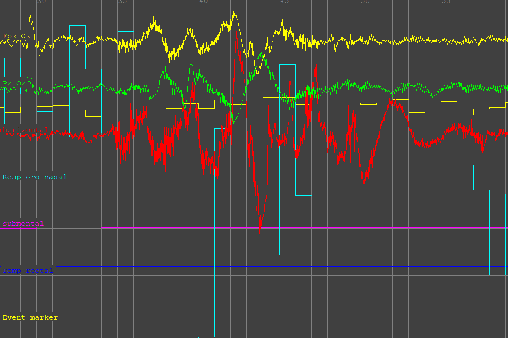

Préparation des Données
======================

Cette section explique comment préparer vos signaux biomédicaux pour l'analyse.

Types de Signaux Supportés
--------------------------

Notre modèle peut analyser plusieurs types de signaux :

* **EEG (Électroencéphalogramme)** - Activité cérébrale
* **ECG (Électrocardiogramme)** - Rythme cardiaque
* **EOG (Électrooculogramme)** – Mouvements oculaires
* **EMG (Électromyogramme)** - Activité musculaire
* **Signaux respiratoires** - Flux d'air nasal/oral
* **Oxymétrie de pouls** - Saturation en oxygène

Formats de Données Acceptés
---------------------------

.. list-table:: Formats supportés
   :widths: 20 30 50
   :header-rows: 1

   * - Format
     - Extension
     - Description
   * - European Data Format
     - .edf
     - Standard médical pour signaux
   * - MATLAB
     - .mat
     - Matrices MATLAB
   * - CSV
     - .csv
     - Données tabulaires
   * - NumPy
     - .npy
     - Arrays NumPy sauvegardés

Étapes de Préprocessing
-----------------------

1. **Chargement des données**

.. code-block:: python

    import mne
    import os
    
    # Spécifiez le chemin vers votre fichier .edf
    edf_file = 'chemin_de_votre_file.edf'
    
    # Chargement du fichier EDF
    raw = mne.io.read_raw_edf(edf_file, preload=True)
    
    # Affichage des informations sur les canaux disponibles
    print(raw.info)
    
    # Liste des canaux disponibles
    print("Canaux disponibles:", raw.ch_names)

.. note::
Ce code utilise MNE-Python pour charger les fichiers EDF. Le paramètre ``preload=True`` charge toutes les données en mémoire pour accélérer les opérations.
L'objet ``raw.info`` contient les métadonnées essentielles comme la fréquence d'échantillonnage et la durée de l'enregistrement.

2. **Transformation en CSV**

.. code-block:: python

    import pandas as pd
    import numpy as np

    # Extraire les signaux en DataFrames
    eeg_data = raw.get_data(picks=['EEG Fpz-Cz'])
    emg_data = raw.get_data(picks=['EMG submental'])
    eog_data = raw.get_data(picks=['EOG horizontal'])

    # Créer des DataFrames pandas
    sampling_freq = raw.info['sfreq']
    times = np.arange(0, len(eeg_data[0])) / sampling_freq

    eeg_df = pd.DataFrame({
    'timestamp': times,
    'value': eeg_data[0],
    'channel': 'EEG Fpz-Cz'
    })

    emg_df = pd.DataFrame({
    'timestamp': times,
    'value': emg_data[0],
    'channel': 'EMG submental'
    })

    eog_df = pd.DataFrame({
    'timestamp': times,
    'value': eog_data[0],
    'channel': 'EOG horizontal'
    })

   # Sauvegarder en CSV si nécessaire (optionnel dans Kaggle)
   eeg_df.to_csv('eeg.csv', index=False)
   emg_df.to_csv('emg.csv', index=False)
   eog_df.to_csv('eog.csv', index=False)

   # Afficher les premières lignes pour vérification
   print("Données EEG:")
   print(eeg_df.head())

   # Fusionner tous les signaux dans une seule DataFrame
  dftotal = pd.concat([eeg_df, emg_df, eog_df], ignore_index=True)

  # Afficher les premières lignes de la DataFrame fusionnée
  print("\nDonnées fusionnées (dftotal):")
  print(dftotal.head())

  # Sauvegarder la DataFrame fusionnée en CSV si nécessaire
  dftotal.to_csv('all_signals.csv', index=False)

.. important::
La fonction ``get_data(picks=[...])`` extrait sélectivement les canaux spécifiés. 
Le calcul du timestamp convertit les indices d'échantillons en temps réel (secondes) en divisant par la fréquence d'échantillonnage.
La fusion avec ``pd.concat()`` crée une structure longue où chaque ligne représente un point temporel pour un canal spécifique.

.. image::_static/images/csv.png
    :alt: Fichier CSV 
    :width: 500px
3. **Suppression Des NaN et Visualisation**

.. code-block:: python

    import statsmodels.api as sm
    import pandas as pd
    from sklearn.preprocessing import MinMaxScaler
    import matplotlib.pyplot as plt
    dftotal.isna().sum()
    dftotal.dropna(inplace=True)
    
    sm.qqplot(dftotal.Label, line='s')
    sm.qqplot(dftotal["EEG Fpz-Cz"], line='s')

    # Supposons que votre DataFrame est dftotal
    colonnes_signaux = ['EEG Fpz-Cz', 'EEG Pz-Oz', 'EOG horizontal', 'EMG submental']

    # Initialiser le MinMaxScaler (par défaut, mise à l'échelle entre 0 et 1)
    scaler = MinMaxScaler()

    # Appliquer la normalisation aux colonnes sélectionnées
    dftotal[colonnes_signaux] = scaler.fit_transform(dftotal[colonnes_signaux])
    
    dftotal['EEG Fpz-Cz'].plot(title="EEG Fpz-Cz	",figsize=(20,5))
    plt.show()
    
    dftotal['EEG Pz-Oz'].plot(title="EEG Pz-Oz",figsize=(20,5))
    plt.show()
  
    dftotal['EOG horizontal'].plot(title="EOG horizontal",figsize=(20,5))
    plt.show() 

.. tip::
La vérification des NaN avec ``isna().sum()`` identifie les canaux problématiques (déconnexions d'électrodes, artefacts).
Les Q-Q plots évaluent la normalité des distributions. 
La normalisation MinMax transforme tous les signaux vers l'échelle [0,1], éliminant les différences d'amplitude entre types de signaux - essentiel pour l'apprentissage automatique.

.. image::_static/images/avant.png
    :alt: avant suppression 
    :width: 500px

.. image::_static/images/apres.png
    :alt: apres suppression 
    :width: 500px