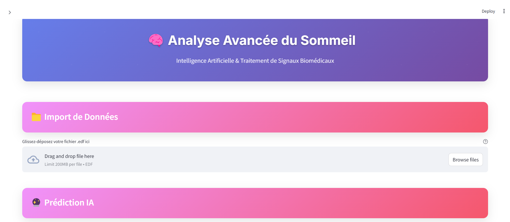
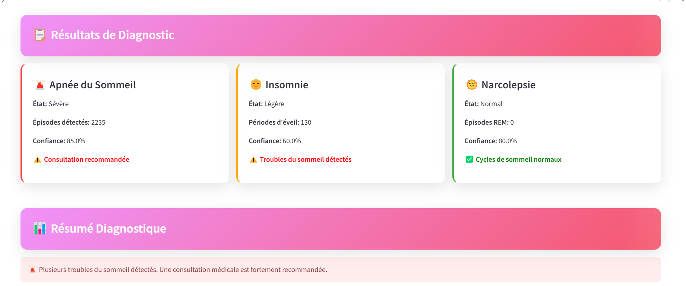
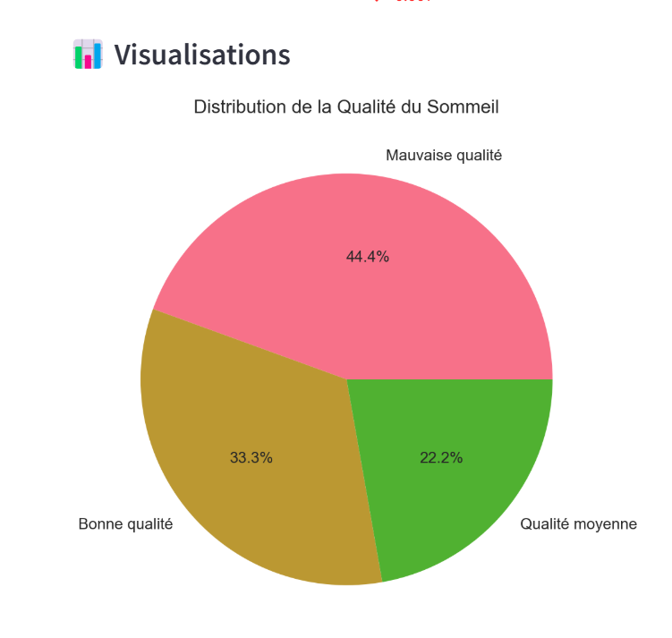
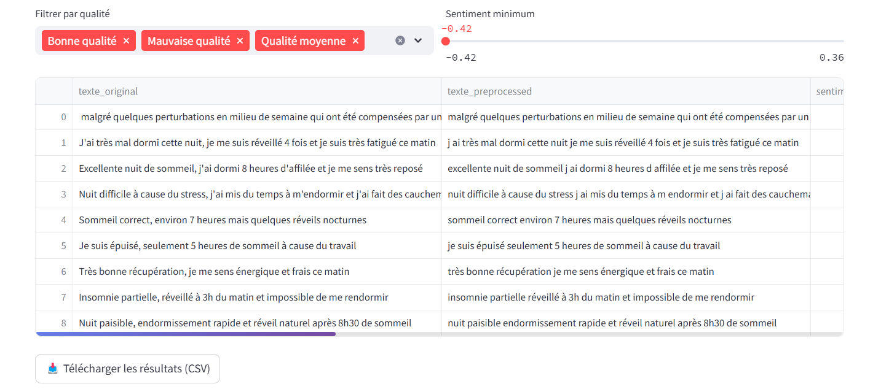

Application Streamlit
====================

Application sleep_app pour prediction des troubles de Sommeil
----------------------------------------------------------------

Brève description de votre application Streamlit, son objectif et ses fonctionnalités principales.

Fonctionnalités
---------------

* **📁 Import de fichiers EDF** : Chargez vos enregistrements de sommeil
* **📊 Visualisation interactive** : Explorez vos signaux EEG/EMG avec Matplotlib
* **🌊 Analyse spectrale** : Analysez les bandes de fréquences cérébrales (Delta, Theta, Alpha, Beta, Gamma)
* **📈 Statistiques détaillées** :  Moyennes, écarts-types, RMS par canal
* **🔮 Prédiction de signaux** : Utilisez l'IA pour prédire les signaux futurs
* **📥 Export des résultats** : Téléchargez vos analyses et rapports
* **Prediction Des troubles** :  Predire les troubles de sommeil a partir des predictions de EEG/EMG
* **📊 Analyseur de sommeil** : affichage de qualite de sommeil..
Installation et utilisation
----------------------------

Prérequis
~~~~~~~~~

.. code-block:: bash

   pip install streamlit
   pip install pandas  
   pip install numpy  
   pip install tensorflow
   pip install matplotlib
   pip install seaborn 

Installation de l'application
~~~~~~~~~~~~~~~~~~~~~~~~~

1. Télécharger les fichiers depuis : `Lien vers releases <https://github.com/votre-repo/releases>`_
2. Extraire l'archive
3. lancer l'app 

Lancement
~~~~~~~~~~~~~~~~~~~~~~~~~
.. code-block:: bash

   streamlit run sleep_app.py

L'application sera accessible à l'adresse : http://localhost:8501

Captures d'écran
----------------
.. Note::
C'est l'overview de l'application

.. Note::
Resultat des troubles de sommeil

.. Note::
Resultat De NLP Analyseur de sommeil

.. image:: _static/images/res1.png
   :alt: Résultats de l'analyse
   :width: 600px

.. image:: _static/images/res2.png
   :alt: Résultats de l'analyse
   :width: 600px

   

Utilisation
-----------

1. **Étape 1** : Importer un fichier .edf qui contient les signaux biomédicaux
2. **Étape 2** : Lancer la prédiction avec le modèle personnalisé
3. **Étape 3** : Cliquer sur "Analyser les troubles du sommeil" pour afficher les troubles futurs

Dépannage
---------

Problèmes courants
~~~~~~~~~~~~~~~~~

* **Erreur de port** : Vérifier que le port 8501 est libre
* **Dépendances manquantes** : Installer les packages requis

